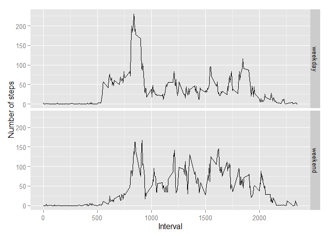

# Reproducible Research: Peer Assessment 1


## Loading and preprocessing the data

```r
Sys.setlocale("LC_TIME", "English")
```

```
## [1] "English_United States.1252"
```

```r
activity <- read.csv("activity.csv")
activity$date <- as.Date(activity$date,format = "%Y-%m-%d")
```


## What is mean total number of steps taken per day?

```r
sumPerday <- aggregate(x = activity[c("steps")],FUN = sum,na.rm = TRUE,by = list(date = activity$date))
hist(sumPerday$steps,xlab = "steps",main = "Summation of per day's steps")
```

 

```r
meanOfSum <- mean(sumPerday$steps)
medianOfSum <- median(sumPerday$steps)
```
The mean of the total number of steps is 9354.2295082. 
The median of the total number of steps is 10395. 


## What is the average daily activity pattern?

```r
averagePerInterval <- aggregate(x = activity[c("steps")],FUN = mean,na.rm = TRUE,by = list(interval = activity$interval))
plot(x = averagePerInterval$interval,y = averagePerInterval$steps,type = "l",xlab = "Interval",ylab = "Average steps",main = "The average steps per interval recently")
```

 

```r
orderbydec <- order(averagePerInterval$steps,decreasing = TRUE)
top <- averagePerInterval$interval[orderbydec[1]]
```
The 835th interval contains the maximum number of steps.

## Imputing missing values

```r
NaNums <- sum(is.na(activity$steps))
NewActivity <- activity
for(i in NewActivity$interval)
{
    NewActivity[(is.na(NewActivity$steps)&(NewActivity$interval == i)),1] <- averagePerInterval[averagePerInterval$interval==i,2]
}
newSumPerday <- aggregate(x = NewActivity[c("steps")],FUN = sum,na.rm = TRUE,by = list(date = NewActivity$date))
hist(newSumPerday$steps,xlab = "steps",main = "New summation of per day's steps")
```

 

```r
newMeanOfSum <- mean(newSumPerday$steps)
newMedianOfSum <- median(newSumPerday$steps)
```
1.The total number of rows with NAs is 2304  
2.The new mean of the total number of steps is 1.0766189\times 10^{4}.  
  The new median of the total number of steps is 1.0766189\times 10^{4}.  
3.These values differ from the first part of the assignment.  
4.Imputing missing data on the estimates makes total daily number bigger.  


## Are there differences in activity patterns between weekdays and weekends?

```r
NewActivity$weekdays <- weekdays(NewActivity$date)
NewActivity$weekdays <- as.factor(NewActivity$weekdays)
levels(NewActivity$weekdays) <- c("weekday","weekday","weekend","weekend","weekday","weekday","weekday")
newAverageWeekday <- aggregate(x = NewActivity[c("steps")],FUN = mean,na.rm = TRUE,by = list(interval = NewActivity$interval,weekdays = NewActivity$weekdays))
library(ggplot2)
qplot(x = interval,y = steps,data = newAverageWeekday,facets = weekdays ~ .,geom = "line",xlab = "Interval",ylab = "Number of steps")
```

 
